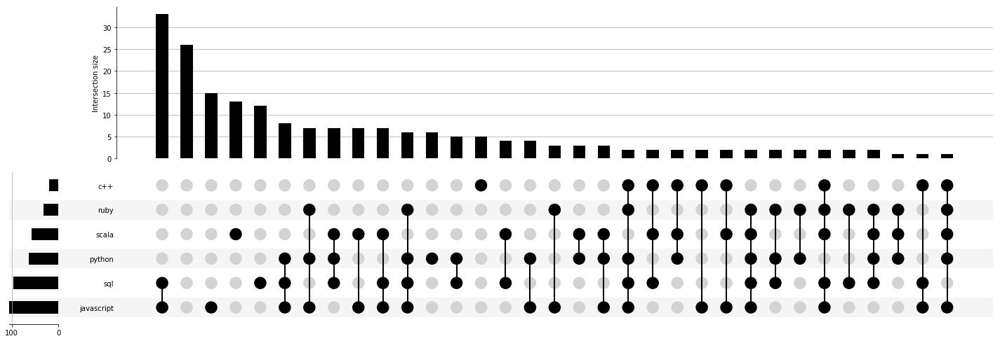

# GitHub Jobs API

The intro for this workshop is on the [Python Project Night webpage](http://chicagopython.github.io/posts/github-jobs-api/).  We want to explore the GitHub Jobs API and see what we can learn.


* Their wepage is: https://jobs.github.com 
* If we navigate to the bottom of the page, we will see their API documentation: https://jobs.github.com/api


## Challenge #0: Getting acquainted

The first part of using an API us understanding how to interface with it. The GitHub Jobs API is an HTTP endpoint where the user sends an HTTP request (like for a webpage) and gets back a response. For the GitHub API, the response will be a JSON-formatted string. You can even see it in your browser:

* This URL is for the regular HTML: https://jobs.github.com/positions?description=python&location=chicago
* This URL is for the JSON: https://jobs.github.com/positions.json?description=python&location=chicago

It is hard for a human to interpret JSON-formatted data; a viewer may help. To explore the format of the data, feel free to go to https://codebeautify.org/jsonviewer

### [codebeautify.org](https://codebeautify.org/jsonviewer)

* Click the **Load URL** button and paste the URL for the JSON in the popup window.
* You can also expand the window so it's not just half of the screen.

Go back to the API documentation and iterate a bit between the viewer page and the docs until you understand the format of the API:

* Try example queries with the other fields, such as **description**, **location**, **full_time**
* Try the pagination


## Challenge #1: Pull the data

OK, Python! Open up a text editor to save your code, and a Python shell to experiment in. You will probably want to use

* [`requests`](https://2.python-requests.org) for the HTTP GET request -- `pip install requests`
* You will have to pass query parameters using the `params` keyword argument ([documentation](https://2.python-requests.org/en/master/user/quickstart/#passing-parameters-in-urls))
* It has a [built-in JSON decoder](https://2.python-requests.org/en/master/user/quickstart/#json-response-content)


Possible suggestions

* It may be helpful to pull one single job at first to be able to parse the formatting
```
https://jobs.github.com/positions/<single-job-id>.json
```
* You may want to write a function that wraps the HTTP request so you only need to send it parameters for the query
* Advanced users may be interested in writing a [generator](https://docs.python.org/3/howto/functional.html#generators) for the pagination


Don't spend too much time on this step -- the fun part is data exploration!


## Challenge #2: Exploratory Data Analysis (EDA)

Exploratory Data Analysis is really what it sounds like: bumbling around in the weeds of the dataset _exploring_ what is there. So literally go key by key in the dictionary (JSON) response object and see what's there. You don't have to look at every key and value...but do dig a little into the things that seem promising, surprising, or interesting.

* There's nothing wrong with simply counting results from queries with different **description** strings!
* Though you can try things like checking for a string `"foo" in "FOO data bar data baz baz baz".lower()`
* Or the adventurous may try regex, e.g. `import re; re.search("foo", "FOO data bar data baz baz baz", re.IGNORECASE)`
* You may like the `Counter` object from [`collections`](https://docs.python.org/3/library/collections.html#counter-objects) in the Python standard library.

For example, if you had the response data in an object called `results` you could group by company like this:

```python
all_the_companies = Counter(result['company'] for result in results)
```

Or if you want to search for a specific set of languages (maybe the ones you know!)...you can do that.


## Challenge #3: Visualization

Exploring data can be aided significantly by plotting the data. It's often easier to visualize insights than to learn them just from looking at data. Visualizations are also a great way to summarize information when sharing your findings.

If you're not working in a Jupyter notebook, consider creating one now to make inspecting the visualizations easier. In your environment, `pip install jupyter`. Then type `jupyter notebook` from your terminal.

One cool visualization you might consider making is an upset plot. This chart type allows you to plot multiple set intersections (like a Venn Diagram on steroids). Luckily, a Python library called UpsetPlot exists to make creation easy. Let's `pip install upsetplot` from our terminal (or `!pip install --quiet upsetplot` from within Jupyter). An example of what your upsetplot might look like:



### Some questions you might want to consider:

Does the dataset tell you anything about which companies use the GitHub for hiring at all? In which cities? Should we move to a different part of the country? Should I learn Go? Kubernetes? Is Data Science saturated? Growing? Does one company's job posts overwhelm the dataset?

- Where might you get additional information?
- How often should you pull the data? What would capture over time give you?
- Choose your own adventure and share with the group what you have learned!
