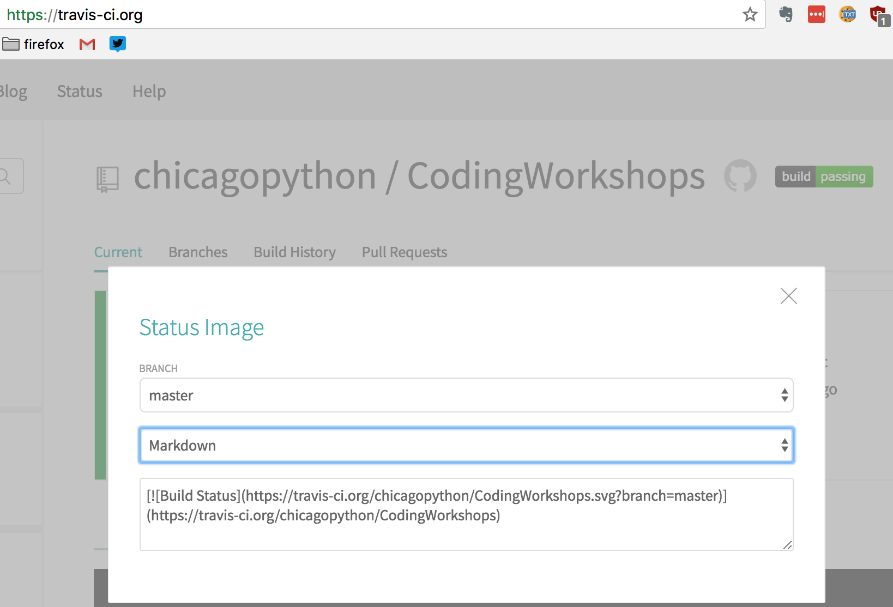

# 1. Introduction to PyTest and Continuous Integration

<!-- TOC -->

- [1. Introduction to PyTest and Continuous Integration](#1-introduction-to-pytest-and-continuous-integration)
    - [1.1. Setup Instructions](#11-setup-instructions)
        - [1.1.1. Git and Github](#111-git-and-github)
        - [1.1.2. Travis setup](#112-travis-setup)
    - [1.2. Python](#12-python)
    - [1.3. Quick Git command refresher](#13-quick-git-command-refresher)
    - [1.4. Exercise 0: Project Setup](#14-exercise-0-project-setup)
        - [1.4.1. `team_organizer.py`](#141-team_organizerpy)
        - [1.4.2. `test_team_organizer.py`](#142-test_team_organizerpy)
        - [1.4.3. `Makefile`](#143-makefile)
        - [1.4.4. `Pipfile` and `Pipfile.lock`](#144-pipfile-and-pipfilelock)
        - [1.4.5. `pytest.ini`](#145-pytestini)
        - [1.4.6. `travis.yml`](#146-travisyml)
        - [1.4.7. Test your setup is working](#147-test-your-setup-is-working)
    - [1.5. Exercise 1: Build](#15-exercise-1-build)
    - [1.6. Exercise 2: Run the program](#16-exercise-2-run-the-program)
    - [1.7. Exercise 3: Running the tests](#17-exercise-3-running-the-tests)
    - [1.8. Execrise 4: Coverage](#18-execrise-4-coverage)
    - [1.9. Exercise 6: Fail, Fix, Pass](#19-exercise-6-fail-fix-pass)
    - [1.10. Exercise 7: Fixtures](#110-exercise-7-fixtures)
    - [1.11. Exercise 8: Implement the tests](#111-exercise-8-implement-the-tests)
    - [1.12. Exercise 9: Implement the tests first, then implement the feature](#112-exercise-9-implement-the-tests-first-then-implement-the-feature)

<!-- /TOC -->

Testing and Continuous Integration is at the heart of building good software.
For this project we will be focus on writing tests for a given problem and use
travis-ci for running the tests automatically everytime code is checked into Github.

**Objectives**:
In this project we will explore

- Introduction to unit testing with pytest
- How to setup continuous integration with Github and Travis-CI

## 1.1. Setup Instructions

For doing this project you will need a Github account, a Travis-ci.org account and git
installed locally.

### 1.1.1. Git and Github

After completing the steps below you should have a github account and be able to push
your local changes to this repository to github.

- Follow the setup steps described [here](https://help.github.com/articles/set-up-git/)
- Read the steps described in [fork a repo](https://help.github.com/articles/fork-a-repo)
- Use the steps described above to fork this repository [CodingWorkshops](https://github.com/chicagopython/CodingWorkshops)

The changes that you make as a part of this exercise, will be pushed to the fork you created for this
repository.

In case you have already have created a fork of this repository in your github account, you will
want to bring it up to date with the recent changes. In that case,
you will need to do the following:

- [configuring a remote fork](https://help.github.com/articles/configuring-a-remote-for-a-fork/)
- [syncing a fok](https://help.github.com/articles/syncing-a-fork/)

### 1.1.2. Travis setup

Continuous Integrration is a critical part of building your software. It automatically runs
the tests when you check in code into your version control (git) and paves the way for
continuous delivery, i.e. release often and release early.
In this section we will set up a Continuous Integration pipeline with Travis-ci.

- First, head over to [Travis-CI.org](https://travis-ci.org/.)
- Sign in with your Github account, and accept the terms and conditions.
- On success, you will be landing on your profile page that lists the CodingWorkshop repository
- Once you have located the repo, toggle the button next to the repository to enable travis CI


If you have multiple repositories, you will have to search for the repository by typing in the name
of the repository (CodingWorkshop) in the search bar on the dashboard page.

## 1.2. Python

This project has made no attempt to be compatible with Python 2.7. 😎

Recommended version: Python 3.6

## 1.3. Quick Git command refresher

Below are the few most used git commands

    git checkout master          # checkout to master branch
    git checkout -b feature/cool # crate a new branch feature/cool
    git add -u                   # stage all the updates for commit
    git commit -am "Adding changes and commiting with a comment"
    git push origin master       # push commits to develop/ci branch

Note for this exercise, we will be working on the master branch directly. However,
that is NOT the best practice. Branches are cheap in git, so a new feature or fix
would first go to a branch, get tested, code reviewed and finally merged to master.

## 1.4. Exercise 0: Project Setup

After completing the steps in setup, you should have the cloned versoin of the fork of CodingWorkshop
repository in your local machine. Lets take the time to look at the structure of this
project. All code is located under `/problems/py101/testing` directory. So from your
terminal go to the directory where you have cloned the repository.

    cd path/to/clone/problems/py101/testing

Make sure you are in this directory for the remainder of this project.

Run `pwd` (`cwd` for Windows) on the command prompt to find out which directory you
are on.

Your output should end in `problems/py101/testing` and contain the files described
below.

### 1.4.1. `team_organizer.py`

This file is a simplified implementation of the problem of grouping the project
night attendees into teams of four based on the number of lines of code they have
written such that in each team, two team members have more lines of code than the other.
This is the system under test.

### 1.4.2. `test_team_organizer.py`

This file is the test for the above module written using Pytest.

These two files mentioned above are the only two files that we will be making
modifications to for this project.

### 1.4.3. `Makefile`

This file contains the commands that are required building the project.
You can run `make help` to see what are the options.

### 1.4.4. `Pipfile` and `Pipfile.lock`

These two files are used by `pipenv` to create a virtual enviornment that
isolates all the dependencies of this project from other python projects in your computer.
Learn more about [pipenv](https://docs.pipenv.org/).

### 1.4.5. `pytest.ini`

This file contains the configuration for `pytest`.

### 1.4.6. `travis.yml`

In addition to all the files in this directory, located at the root of the repository,
is a file called `.travis.yml`. This is used by the continuous intergration tool travis-ci.
This contains the information on how to build this python project.

### 1.4.7. Test your setup is working

Just make a small edit on this file (README.md), commit and push the changes.

    git commit -am "Demo commit to check everything is working"
    git push origin master

If travis-ci.org gets triggered and is all green, your push has successfully ran through
the linting and testing pipeline.

To display that badge of honor, click on the build button next on the travis page and select
Markdown from the second dropdown. Copy the markdown code displayed and add it to the top
of this file (README.md).



If you run into issues, [ask your question on slack](https://chipy.slack.com/messages/C093F7W8P/details/)

## 1.5. Exercise 1: Build

From the `/problems/py101/testing` directory, run

    make

- Which packages got installed?
- Which version of python is getting used?
- How many tests pass, skipped and how long did it take?
- Note a new directory `htmlcov` was created. We will revisit this in Exericse 5.
- What is difference in output when you run the `make` command again?

## 1.6. Exercise 2: Run the program

Start by running

    python team_organizer.py

This will drop you to the program's interactive prompt.
Below is a sample interaction where users named a, b, c,
d, e and f are added using the add command.
Following that, we run the `print` command where the users
are grouped in to max of size four where two users have
written less lines of code than the others.

    ```
    t (master *) testing $ python team_organizer.py
    Welcome to Chicago Python Project Night Team Organizer
    org> help
    help
    
    Documented commands (type help <topic>):
    ========================================
    add  help  print
    
    Undocumented commands:
    ======================
    exit
    
    org> help add
    help add
    Adds a new user. Needs Name slackhandle number_of_lines separated by space
    org> add a @a 100
    add a @a 100
    org> add b @b 200
    add b @b 200
    org> add c @c 300
    add c @c 300
    org> add d @d 400
    add d @d 400
    org> add e @e 500
    add e @e 500
    org> add f @f 50
    add f @f 50
    org> print
    print
    ['f, a, e, d']
    b, c
    org>
    ```

## 1.7. Exercise 3: Running the tests

Run

    make test

This will run the tests in the `test_team_organizer.py` file.

Run

    pipenv run pytest --help

Now check the flags that are present in the `pytest.ini` file against
the output of the `--help` command to see what each one does.

## 1.8. Execrise 4: Coverage

When we first ran `make`, `pytest` created a directory called `htmlcov`
that show you the coverage information about `team_organizr,py` code.
Open the `index.html` file inside `htmlcov` to check the lines that
has not been covered by the tests in the `test_team_organizer.py`.

What is the % coverage of the code at this point?
Click on `team_organizer.py` to see which lines are outside coverage.

## 1.9. Exercise 6: Fail, Fix, Pass

You are now all set to fix the tests. Goto `test_team_organizer.py` and
find `test_add_a_person_with_lower_than_median` test. Notice this test is
skipped when run with pytest. To fix it remove the decorator `pytest.mark.skip`
and run `pytest` again. Commit the code and run

    make test

Make the necessary changes so that the test passes.

    git commit -am "Fixed failing test"
    git push origin master

Go to travis-ci.org and inspect the output before and after fixing the test.
What is the coverage value at this point?

## 1.10. Exercise 7: Fixtures

The purpose of test fixtures is to provide a fixed baseline upon which tests can
reliably and repeatedly execute.

We are making use of two fixtures - one factory method `person` that churns out Persons
as needed by `organizer` fixture.

`test_count_number_of_teams` is broken as well. How can you fix it?

Tip: To run a singe test, use

    pipenv run pytest -k <name-of-test>

## 1.11. Exercise 8: Implement the tests

The two functions below have been left for you to implement.

- test_add_a_person_who_has_never_written_code_before
- test_add_two_person_with_same_name_but_different_slack_handles

Note the names of the tests are long and verbose to give you an idea of what
what exactly you need to test.

Does implementing these tests have any effect on coverage results?
Would it be still useful if there is no improvement in coverage?

## 1.12. Exercise 9: Implement the tests first, then implement the feature

For the following two tests, first implement the test that asserts the
expected behavior. From the test name it should be evident from the test name.
If you run the tests at this point, they should fail. Then go back to
`team_organizer.py` and implement the feature by changing the code.
Once your implementation is complete, run `make test`.

- test_adding_person_with_negative_lines_of_code_throws_exception
- test_handle_duplicate_additions
