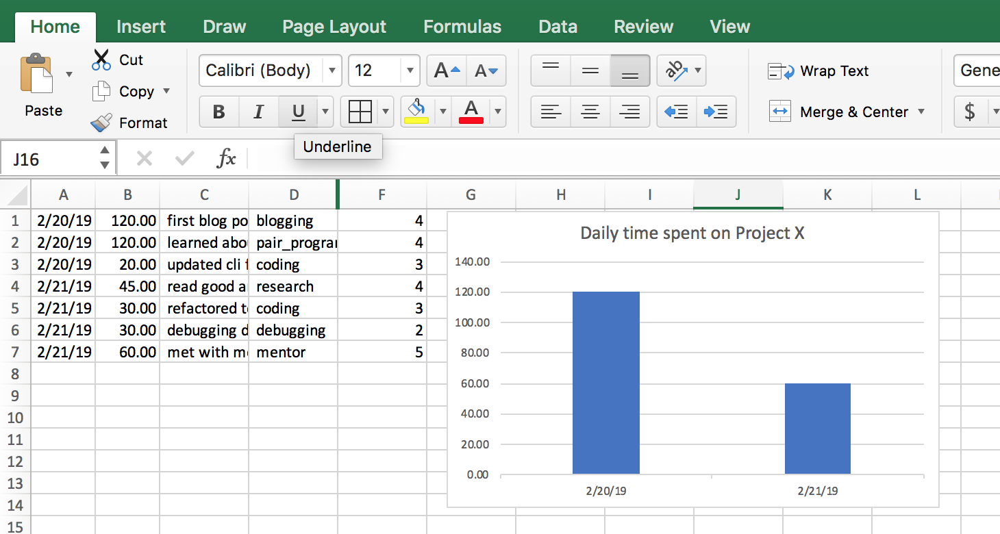

# 1. Mentorship Journal

Chipy's mentorship program is an extra-ordinary jounery for becoming a better developer.
As a mentee, you are expected to do a lot - you read new articles/books, write code,
debug and troubleshoot, pair program with other mentees in coding workshop or your mentor.
This is involves managing time efficiently and doing the effective things.
But as the old adage goes, "you can't manage what you can't measure".

This project is the first of the three part series of building tools for the mentees for
tracking time. The end goal of such a tool will be to give you a tool that helps you record mini
journal entires every day. The tool would also show you insight into your learning patterns
allowing you to make better decisions on when allocating time for self directed learnings beyond the
mentorship program.  

## 1.1. The Done list

Lets say you were to keep an account of every thing you have accomplished during your mentorship.
The minimalistic way for doing that would be noting things down in a text file - think of it as
a journal that you update frequently.

```
    Date: 02/20/2019
    first blog post completed 🏅
    learned about using click at project night
    updated cli for the app

    Date: 02/21/2019
    read good article on decorators http://realpython.org/
    refactored to use decorators for orthogonal logic
    debugging decorators
    met with mentor to fix decorator issues
```

With a little bit of effort, you can capture two more data points with each of the accomplishment
you are recording in this mini journal entry.

(a) the time spent
(b) the type of activity

These will form the basis of gaining insights into your personal learning patterns.

For example:

```
Date: 02/20/2019
first blog post, blogging, 120 mins
learned about using click at project night, pair_programming, 120 mins
updated cli for the app, coding, 20 mins

Date: 02/21/2019
read good article on decorators http://realpython.org/, research, 45 mins
refactored to use decorators for orthogonal logic, coding, 30 mins
debugging decorators, debugging, 30 mins
met with mentor to fix decorator issues, mentor, 60 mins
```

While recording each of these activities have taken up time, you'll probably find one was
more useful than the other. So add another field to your
entry, effectiveness and refactor a little bit.

```
02/20/2019, first blog post, blogging, 120 mins, 4
02/20/2019, learned about using click at project night, pair_programming, 120 mins, 4
02/20/2019, updated cli for the app, coding, 20 mins, 3
02/21/2019, read good article on decorators http://realpython.org/, research, 45 mins, 4
02/21/2019, refactored to use decorators for orthogonal logic, coding, 30 mins, 3
02/21/2019, debugging decorators, debugging, 30 mins, 2
02/21/2019, met with mentor to fix decorator issues, mentor, 60 mins, 5
```

If you save this file as a .csv now and open it in excel, you'll be able to get an account of how your time has been spent by selecting all the rows
for the last but one column. Taking the next step, you can very easily build a bar graph of time spent per day by including the first column.



We could have stopped right here and let you continue with a spreadsheet. as a system for your mentorship journal. But lets make it a fun, reliable,and smooth.

### 1.1.1. The Data structure

Having looked at the data we intend to capture, lets try to reason how each entry in the row
can be represented by variables in a script and what their type would be like.

```
    task: str
    description: str
    timestamp: datetime.timestamp
    mins: int
    effective: int
    done: bool
```

Note: I have sneaked in a variable `done`, which can tell us if this task is completed. We would not use it right now, but with a little bit of effort we can use this field to enhance this app to have a Todo list feature. With these as a member variables, we can now define a `class` for our `app.py`. A class is nothing but an abstract representation of how each of our data record (or object) should look like and behave.

You'll find this in `app.py`-s line 16-22.

### 1.1.2. Replacing csv with a database

csv or spreadsheets are a good start for storing data, but are not without limitations. For project like ours, where we are looking to do automation, analytics and integration with more than one system we should be better of using a database.
There are a lot of databases to chose from, however but for something simple like ours we will use the `sqlite` that comes with the python installation. Lets now look at the different ways how we can capture the data in a python script, persist it into the database, and as well as retrieve it for further processing.

#### 1.1.2.1. Object Relational Mapper (ORM)

Each of your mini journal entry would be first captured as
a Python object using the `app.py` script that we will build in part 1. `app.py` will also convert the python object
into a database record using an Object Relatoinal Mapper(orm) and persist the data into the database. If you want to retrieve/update/delete a record from the database, the ORM allows you to use a similar Pythonic code to get the data back.

#### 1.1.2.2. SQL/Pandas

While the ORM allows you to write Python directly, the primary mechanism for querying the data in relational databases is
Structed Query Language (SQL) which is english like query language that allows you to create,
retrieve, summarize and analyze the data. We would be using SQL and pandas in part three for analysis of the data.

### 1.1.3. Building the app in three parts


### 1.1.4. Part 1: The terminal client

Since most of our development time is spent on a terminal, in part 1 we will be building a terminal based client. The client will provide a simple interface to add a data record of your mini journal entry into the database.

### 1.1.5. Part 2: Web interface

After the database has been populated with entries we made in part 1, we will build a web interface that pulls
up data from the database and presents a dashboard to show where time was spent.


### 1.1.6. Part 3: Data Analysis

Once the data enty and output part is complete, in part 3, we will use data science tools to
answer questions regarding your learning patterns. As a strech goal, we will enhance the dashboard built in part 2, with metrics and insights coming out of part 3.

## 1.2. Part 1

In this project we will explore

- How to build command line applications using `prompt_toolkit`, `click`
- How to store data in sqlite database that comes with Python using `peewee` ORM

## 1.3. Setup Instructions

You will need a text editor like Visual Studio Code, Atom or Sublime Text. Since this
you'll be working in a group, having an editor that does not get in the way of solving
the problem is essential. So stick to what every one in your team is familiar with.

### 1.3.1. Download .zip from github

If you are not familiar with `git`, you can download the repository from [here](https://github.com/chicagopython/CodingWorkshops/archive/master.zip).
Clicking on the link will download a .zip file to your computer. Next you need to
navigate to the folder where it was downloaded and unzip the folder. Once you have
the CodingWorkshop directory, you can go to step 1.5.

### 1.3.2. Git and Github [Optional]

After completing the steps below you should have a github account and be able to push
your local changes to this repository to github.

- Follow the setup steps described [here](https://help.github.com/articles/set-up-git/)
- Read the steps described in [fork a repo](https://help.github.com/articles/fork-a-repo)
- Use the steps described above to fork this repository [CodingWorkshops](https://github.com/chicagopython/CodingWorkshops)

The changes that you make as a part of this exercise, will be pushed to the fork you created for this
repository.

In case you have already have created a fork of this repository in your github account, you will
want to bring it up to date with the recent changes. In that case,
you will need to do the following:

- [configuring a remote fork](https://help.github.com/articles/configuring-a-remote-for-a-fork/)
- [syncing a fork](https://help.github.com/articles/syncing-a-fork/)

## 1.4. Python

This project has made no attempt to be compatible with Python 2.7. 😎

Recommended version: Python 3.6 or higher.

## 1.5. Quick Git command refresher [Optional]

Below are the few most used git commands

    git checkout master          # checkout to master branch
    git checkout -b feature/cool # crate a new branch feature/cool
    git add -u                   # stage all the updates for commit
    git commit -am "Adding changes and commiting with a comment"
    git push origin master       # push commits to develop/ci branch

Note for this exercise, we will be working on the master branch directly. However,
that is NOT a best practice. Branches are cheap in git, so a new feature or fix
would first go to a branch, get tested, code reviewed and finally merged to master.

## 1.6. Documentation references

Below are the libraries used by this program.

- [prompt_toolkit](https://python-prompt-toolkit.readthedocs.io/en/master/)
- [click](http://click.pocoo.org/5/)
- [peewee](http://docs.peewee-orm.com/en/latest/)


## 1.7. Exercise 0: Project Setup

After completing the steps in setup, you should have the cloned versoin of the fork of `CodingWorkshop`
repository in your local machine. Lets take the time to look at the structure of this
project. All code is located under `/problems/py101/trackcoder` directory. So from your
terminal go to the directory where you have cloned the repository.

    cd path/to/CodingWorkshop/problems/py101/trackcoder

Make sure you are in this directory for the remainder of this project.

Run `pwd` (`cwd` for Windows) on the command prompt to find out which directory you
are on.

Your output should end in `problems/py101/trackcoder` and contain the files described
below.

### 1.7.1. `app.py`

This file contains the code required to get you started with building the project.
You will be building on top of what has been provided in this file.

### 1.7.2. `Makefile`

This file contains the commands that are required building the project.
You can run `make help` to see what are the options.

Note Makefile would not work on Windows out of the box.

### 1.7.3. `Pipfile` and `Pipfile.lock`

These two files are used by `pipenv` to create a virtual enviornment that
isolates all the dependencies of this project from other python projects in your computer.
Learn more about [pipenv](https://docs.pipenv.org/).

## 1.8. Exercise 1: Build

From the `/problems/py101/trackcoder` directory, run

    make

- Which packages got installed?
- Which version of python is getting used?

Skip this exercise for Windows. Install the dependencies using

    pip install prompt_toolkit Click peewee

## 1.9. Exercise 2: Run the program

First shell into your virtual environment

    make shell

This should activate your virtual enviornment, i.e. give you access to a python
environment where all the dependencies for this project has been installed.

Note: If the above command errors out, or you are on Windows, run the following to get into
a shell with the virtualenv acitvated.

    pipenv shell

If everything fails,

    pip install prompt_toolkit Click peewee

Start by running

    python app.py --help

What are the possible options that command has?
Run each option with --help option to see what is the help message provided.

## 1.10. Exercise 3: Fix the help message

### 1.10.1. Interactive mode

Running `app.py` with `-i` - should start the app in interactive mode.
Once in interactive mode, there are two commands `add` and `show`.

The `add` command allows adding a new `Task`. The format is

    % add b 10 first paragraph of first blog post

here `b` is the abbreviations for blogging, `10` shows the time taken for the task. Rest of the sentence is comment.
There are only 6 possible Task types

- blogging (b)
  - coding (c)
  - debugging (d)
  - pair programming at project night (p)
  - research (r)
  - meeting with mentor (m)

For example, an interactive session might look like

>
    % add b 10 first blog post
    % add c 10 finished cli
    % add d 120 debugging decorators
    % add m 120 always keep the final presentation in mind
    % add r 60 read articles on pandas
    % add p 120 learned about decorators

The `show` command allows listing of all the `Task`-s added till now.
>
    % show
    b 10 first blog post
    c 10 finished cli
    d 120 debugging decorators
    m 120 always keep the final presentation in mind
    r 60 read articles on pandas
    p 120 learned about decorators

For this exercise you need to update add helpful messages that will summarize what each
of the options for `app.py` stand for.

## 1.11. Exercise 4: Run in interactive mode

    python app.py -i

Add some tasks and list them out by using the commands shown above. Play around with the up/down
arrow keys to access history of the commands.

Exit the session using `ctrl+D`. From your command prompt, run `ls -l` in linux or mac or `dir`
in windows. What is the name of the file that gets created?

Using sqlite3

    sqlite3 to_do_list.db 'select * from ToDo;'

Compare the output that you get from running `show` and using the command above.

## 1.12. Exercise 4: Run in non-interactive mode

For ease of entering data the program can also be run in non-interactive mode

    python app.py -a b 30  "first blog post completed"
    python app.py -s

Add a few tasks that have been completed and list them non-interactively.
Note you'll need to put the description in quotes in this mode.

### 1.12.1. Optional: For non-windows users only

You can further simplify entering tracking your time by adding a bash shell alias.

    alias add='function _add(){ python app.py -a "$@"; };_add'

Then from your shell you can

    $ add c 30 "finished oauth"

Add a similar shell alias for the `show` command.

## 1.13. Exercise 5: Error handling

Currently we have two commands `add` and `show`. Lets say the user made a typo,
or was creative while trying to input a command.

    % add c api 30 complete

instead of

    % add c 30 api complete

This results in the program crashing horribly with huge stack trace.
Add error handling to handle cases when the program is unable to `parse` the input
passed by the user.

## 1.14. Exercise 6: Enhance the show command

Enhance the show command to summarize the output by task category.
Your summary should include how much time was spent on each of the task category.

As seen above, we are using sqlite3. You may choose to do your summary calculation
using sql or write the logic in python.

## 1.15. Exercise 7: Add a field for task complete or not

Next take a look at

    class ToDo(Model):

This class has a list of fields - task, description, timestamp, mins, done.
Till now we have not been using this field. It has a default value of `True`
to indicate that a completed task is being added.

However, it might not always be the case. You might want to log your work,
and still have incomplete tasks. In fact, logging often and logging early is
encouraged! In order to faciliate that we need to optionally
take a fourth parameter in the input for adding a new task.

Take a look at the decorator right above the `main` function

    @click.option('--add', '-a', nargs=3, type=(click.STRING, int, click.STRING), \
                default=(None, None, None))

This is the starting point for allowing taking in an extra input.
You will find the relevant documentation [here](http://click.pocoo.org/5/options/)

Hint: Note the type of the field is boolean.
You will need to modify the `parse`, `add` and the `main` function in order to complete
this exercise.

## 1.16. Exercise 8: Enhance the summary

Enhance your summary function to show how many tasks are in progress and how many are complete.
How you want to format the information is completely up to your choice.

## 1.17. Exercise 9: Hashtags

Now that you have enabled the flag to indicate if a task is complete or not, you
can log a much fine grained prorgress of your tasks. You can tag your task with
arbitary hashtags in order to provide better semantic information. For example:

    % add p 120 #data_science learned about precision/recall
    % add b 120 finished the blogpost
    % add p 30 #data_science learned about roc curves
    % add p 30 #webdev added a flask interface
    % add d 30 #issues/7 found a bug, new github issue
    % add p 30 #issues/7 closed github issue 7

Enhance the show command to optionally take a hashtag as parameter, that will filter out only
tasks which have that hashtag. Accrodingly your summary should reflect only
data relevant to that hashtag.

## 1.18. Exercise 10: Add a field for effectiveness

Next its time to add a score to your efforts. Add a field to the `ToDo` class called effective,
where you can record how effective a task was. An effective score is a number between 1 to 5,
1 being the lowest and 5 being the highest.

Armed with this data, you should be able to answer
(i) what is taking up most of your time?
(ii) which activities are the most effective for your growth
